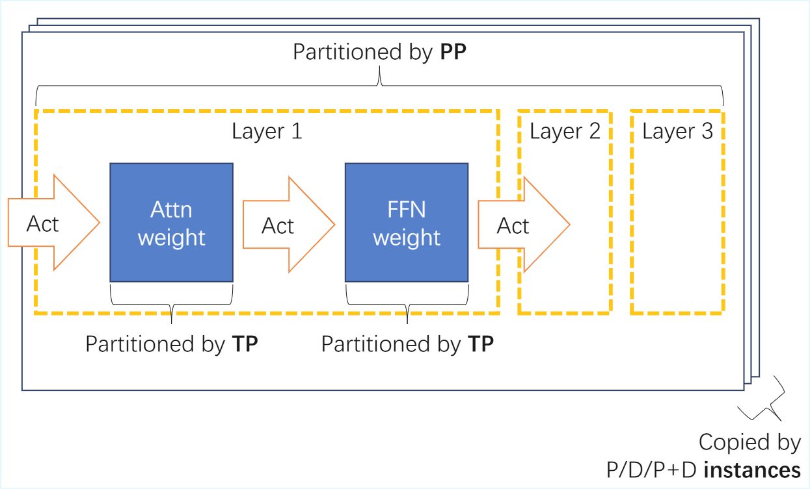
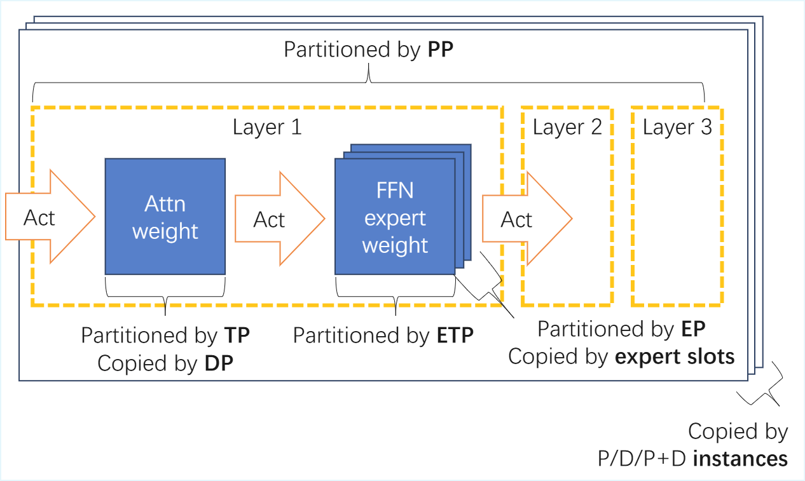

# 开发者手册
## 安装指引
### 使用官方镜像
#### 英伟达

```bash
docker run --rm --gpus=all --privileged --shm-size=1g \
  -v <your_model_path>:<container_model_path> \
  <your_image_name> \
  <your_command>
```

#### 昇腾

```
docker run \
  --rm \
  --device /dev/davinci0 \
  --device /dev/davinci1 \
  --device /dev/davinci2 \
  --device /dev/davinci3 \
  --device /dev/davinci4 \
  --device /dev/davinci5 \
  --device /dev/davinci6 \
  --device /dev/davinci7 \
  --device /dev/davinci_manager \
  --device /dev/devmm_svm \
  --device /dev/hisi_hdc \
  -v /usr/local/dcmi:/usr/local/dcmi \
  -v /usr/local/bin/npu-smi:/usr/local/bin/npu-smi \
  -v /usr/local/Ascend/driver/lib64/:/usr/local/Ascend/driver/lib64/ \
  -v /usr/local/Ascend/driver/version.info:/usr/local/Ascend/driver/version.info \
  -v /etc/ascend_install.info:/etc/ascend_install.info \
  -v <your_model_path>:<container_model_path> \
  <your_image_name> \
  <your_command>
```

#### 沐曦

```
docker run \
  --rm \
  --device=/dev/dri \
  --device=/dev/mxcd \
  --group-add video \
  --privileged=true \
  --security-opt seccomp=unconfined \
  --security-opt apparmor=unconfined \
  --shm-size=100gb \
  --ulimit memlock=-1 \
  -v <your_model_path>:<container_model_path> \
  <your_image_name> \
  <your_command>
```

#### 海光

```
docker run -dit \
  -u root \
  --network=host \
  --privileged \
  --device=/dev/kfd \
  --device=/dev/dri \
  --ipc=host \
  --shm-size=100G \
  --group-add video \
  --cap-add=SYS_PTRACE \
  --security-opt seccomp=unconfined \
  --ulimit stack=-1:-1 \
  --ulimit memlock=-1:-1 \
  -v /opt/hyhal:/opt/hyhal:ro \
  -v <your_model_path>:<container_model_path> \
  <your_image_name> \
  <your_command>
```

#### 摩尔线程

```
docker run -dit \
  --network=host \
  --privileged \
  --shm-size=100G \
  --ulimit memlock=-1 \
  --env MTHREADS_VISIBLE_DEVICES=all \
  --pid=host \
  -v <your_model_path>:<container_model_path> \
  <your_image_name> \
  <your_command>
```

### 从源码安装

#### 1. 获取源码

```bash
# 下载源码，注意使用 --recursive 选项获取第三方依赖
git clone --recursive https://github.com/thu-pacman/chitu && cd chitu
```

#### 2. 安装普通构建时依赖

```bash
pip install -r requirements-build.txt
```

如果你选择的可选依赖中包含 `deep_ep`，还需要运行以下之一:

若为 CUDA 12：

```bash
pip install -r requirements-build-deep_ep-cu12.txt
```

若为 CUDA 13：

```bash
pip install -r requirements-build-deep_ep-cu13.txt
```

#### 3. 安装 PyTorch

在英伟达平台，可以安装最新 PyTorch：

```bash
# 选项 A：安装默认 PyTorch 版本
pip install -U torch
# 选项 B：安装以特定版本 CUDA 构建的 PyTorch 版本（将下列命令中的 cu124 修改成你需要的 CUDA 版本）
pip install -U torch --index-url https://download.pytorch.org/whl/cu124
```

在其他平台，请从该平台的提供商处获得相应的 PyTorch 版本。

#### 4. 安装赤兔

**英伟达平台：**

```bash
# TORCH_CUDA_ARCH_LIST 的值可通过 `python -c "import torch; print(torch.cuda.get_device_capability())"`` 查看
TORCH_CUDA_ARCH_LIST=9.0 pip install --no-build-isolation . -c <(pip list --format freeze | grep -v "flash-mla" | grep -v "flash_mla")
```

注：

- 通过 `-c` 指定的 constraint 选项使 pip 强制赤兔与系统中已有的软件包兼容，而不是在不兼容时自动升级依赖软件包。这有助于避免安装过程破坏系统中已有的 PyTorch 版本。如果你确实需要升级某些软件包，可以将这些软件包从 `-c` 指定的列表中移除。

**昇腾平台：**

```bash
CHITU_ASCEND_BUILD=1 pip install --no-build-isolation . -c <(pip list --format freeze)
```

注：

- 依赖 CANN 和 `torch_npu>=2.5`。
- 建议通过  `third_party/ascend` 目录中的 `whl` 文件安装我们测试过的 `torch_npu` 版本。
- 通过 `-c` 指定的 constraint 选项使 pip 强制赤兔与系统中已有的软件包兼容，而不是在不兼容时自动升级依赖软件包。这有助于避免安装过程破坏系统中已有的 PyTorch 版本。如果你确实需要升级某些软件包，可以将这些软件包从 `-c` 指定的列表中移除。

**海光平台：**

```
CHITU_HYGON_BUILD=1 pip install --no-build-isolation . -c <(pip list --format freeze)
```

注：

- 通过 `-c` 指定的 constraint 选项使 pip 强制赤兔与系统中已有的软件包兼容，而不是在不兼容时自动升级依赖软件包。这有助于避免安装过程破坏系统中已有的 PyTorch 版本。如果你确实需要升级某些软件包，可以将这些软件包从 `-c` 指定的列表中移除。

**沐曦平台：**

```
CHITU_MUXI_BUILD=1 pip install --no-build-isolation . -c <(pip list --format freeze)
```

注：

- 通过 `-c` 指定的 constraint 选项使 pip 强制赤兔与系统中已有的软件包兼容，而不是在不兼容时自动升级依赖软件包。这有助于避免安装过程破坏系统中已有的 PyTorch 版本。如果你确实需要升级某些软件包，可以将这些软件包从 `-c` 指定的列表中移除。

**摩尔平台：**

```
CHITU_MOORE_BUILD=1 pip install --no-build-isolation . -c <(pip list --format freeze)
```

注：

- 通过 `-c` 指定的 constraint 选项使 pip 强制赤兔与系统中已有的软件包兼容，而不是在不兼容时自动升级依赖软件包。这有助于避免安装过程破坏系统中已有的 PyTorch 版本。如果你确实需要升级某些软件包，可以将这些软件包从 `-c` 指定的列表中移除。


#### 选项

一些可选依赖可通过追加  `[optional-dependency-name]` 字样安装，例如：

```bash
TORCH_CUDA_ARCH_LIST=9.0 pip install --no-build-isolation ".[flash_mla]"
```

当前支持的可选依赖项有:

- `flash_attn`: 用于支持 `infer.attn_type=flash_attn`。
  
    > 直接安装 flash_attn 可能很慢，可以到 flash_attn 的 github 上下载相应的预编译包（一个 .whl 文件），然后通过 pip install 这个 .whl 文件。
- `flashinfer`: 用于支持 `infer.attn_type=flash_infer`。
- `flash_mla`: 用于支持 `infer.attn_type=flash_mla`。
- `flash_linear_attention`: 支持通过 `infer.attn_type=flash_linear_attention` 运行 Qwen3-Next 系列模型及类似的模型。
- `deep_gemm`: 用于支持使用 DeepGEMM 进行 fp8 推理。
- `deep_ep`: 用于支持使用 DeepEP 进行 MoE 通信（需要在**安装赤兔前**先在系统中安装 NVSHMEM，NVSHMEM 已经包含在 `requirements-build-deep_ep-cu12.txt` 中）
- `cpu`: 用于支持 CPU+GPU 混合推理。
- `muxi_layout_kernels`: 用于支持在沐曦 GPU 上使用 `infer.op_impl=muxi_custom_kernel` 模式，在小 batch 场景性能更优。
- `scipy`: 用于支持 DeepSeek-V3.2-Exp 中的 indexer 的可选依赖。
- `fast_hadamard_transform`: 用于支持 DeepSeek-V3.2-Exp 中的 indexer 的可选依赖。
- `numa`: 用于支持 NUMA 绑定。

如果需要用于开发，建议加上 `-e` 选项启用 editable install，如

```bash
TORCH_CUDA_ARCH_LIST=9.0 pip install --no-build-isolation -e .
```

可以通过 `CHITU_WITH_CYTHON=1` 使用 Cython 对 Python 代码进行编译，如：

```bash
TORCH_CUDA_ARCH_LIST=9.0 CHITU_WITH_CYTHON=1 pip install --no-build-isolation .
```

注意：
- 同时设置了 `-e` 和 `CHITU_WITH_CYTHON=1` 时，`-e` 不会起作用。如果已经这么做了，需要 `rm chitu/*.so` 恢复。

### 构建分发产物

可按如下步骤构建分发产物：

```bash
./script/build_for_dist.sh <whether-enable-cython>
```

例如：

```bash
./script/build_for_dist.sh true
```

这将创建一个包含 wheel 文件的 `dist/` 目录。将它们复制到您想要的位置，然后使用 `pip install <wheel_file>` 安装它们。如果您必须使用平台的自定义依赖项（例如 `torch`），请在 `pip install` 命令后附加 `--no-deps`。

您也可以选择将 `test/` 目录复制到您想要的位置以运行它们。

## 运行和测试（非部署服务）

**如果您与他人共享测试环境，请合理使用作业管理工具进行资源分配，避免资源冲突。**

默认的配置文件为 [`chitu/config/serve_config.yaml`](../../chitu/config/serve_config.yaml) 。此文件中包含了赤兔所使用的所有运行时配置项的定义。您可以使用命令行参数覆盖相关的参数设置（参考 [Hydra 文档](https://hydra.cc/docs/advanced/override_grammar/basic/)），也可以使用环境变量 `CHITU_CONFIG_PATH=<path/to/config/directory>` 及 `CHITU_CONFIG_NAME=<your_config_file.yaml>` 另行指定配置文件。需要提醒的是，`chitu/config/models/` 目录中的 yaml 文件并非完整的配置文件，切勿直接将 `CHITU_CONFIG_NAME` 指向它们。新指定的配置文件目录应该包含所有直接或间接被使用的配置文件，包括模型配置文件。

### 示例：运行 DeepSeek-R1

> 注：此示例中的参数可能并非最佳。最佳参数需根据实际应用需求与硬件需求调整。

```bash
torchrun --nproc_per_node 8 test/single_req_test.py \
    models=deepseek-r1 \
    models.ckpt_dir=/data/DeepSeek-R1 \
    infer.tp_size=8 \
    infer.pp_size=1 \
    infer.cache_type=paged \
    infer.attn_type=flash_mla \
    infer.mla_absorb=absorb-without-precomp \
    infer.max_batch_size=1 \
    infer.max_seq_len=512 \
    request.max_new_tokens=100
```

运行日志存储在 `outputs/` 目录下。

### 查看支持的模型

```bash
python3 script/generate_supported_models_docs.py --print
```

更多模型请参见 [支持的模型](SUPPORTED_MODELS.md)。

### 单 GPU 推理

```bash
torchrun --nproc_per_node 8 test/single_req_test.py request.max_new_tokens=64 models=DeepSeek-R1 models.ckpt_dir=/data/DeepSeek-R1 infer.pp_size=1 infer.tp_size=8
```

### 并行

赤兔支持多种并行策略。

对于一般模型，赤兔支持 TP（张量并行）、PP（流水线并行）以及多实例部署，如下图所示：



对于 MoE 模型，模型中的 attention 块和 MoE 块可以通过不同方式并行：

- Attention 块可通过 TP（张量并行）和 DP（数据并行）进行并行。
- MoE 块可通过 ETP（专家张量并行）、EP（专家并行）以及（静态或动态）将专家复制到专家槽位进行并行。
- 在 attention 块和 MoE 块之上，还可以进一步通过 PP（流水线并行）以及多实例部署进行并行。

如下图所示：



赤兔会让通信量大的并行方式优先在更近的设备之间通信：

- 对于一般模型或 MoE 模型中的 attention 块，TP 组由最近的设备组成，DP 组由次近的设备组成，PP 组由最远的设备组成。若以分布式网格的方式描述，网格的形状是 PP * DP * TP。请注意赤兔中的 DP 是用于 MoE 中的 attention 块的，所以 DP 在网格中位于 PP 和 TP 之间，而非 PP 之外。若要通过复制权重的方式扩展非 MoE 模型的并行性，请使用多实例部署而非 DP。
- 对于 MoE 模型中的 MoE 块，ETP 组由最近的设备组成，EP 组由次近的设备组成，PP 组由最远的设备组成。若以分布式网格的方式描述，网格的形状是 PP * EP * ETP。MoE 块还可以通过将专家复制到专家槽位的方式来扩展并行性。这种方式类似 DP，但更加灵活。

TP、DP、ETP、EP 和/或 PP 可通过传入 `tp_size`、`dp_size`、`etp_size`、`ep_size` 和/或 `pp_size` 参数开启。ETP 的并行度如不设置，默认等于 `tp_size * dp_size // ep_size`。

TP 样例参数：

```bash
torchrun --nproc_per_node 2 test/single_req_test.py models=<model-name> models.ckpt_dir=<path/to/checkpoint> request.max_new_tokens=64 infer.tp_size=2
```

PP 样例参数：

```bash
torchrun --nproc_per_node 2 test/single_req_test.py models=<model-name> models.ckpt_dir=<path/to/checkpoint> request.max_new_tokens=64 infer.pp_size=2
```

TP+PP 混合的样例参数：

```bash
torchrun --nnodes 2 --nproc_per_node 8 test/single_req_test.py request.max_new_tokens=64 infer.pp_size=2 infer.tp_size=8 models=DeepSeek-R1 models.ckpt_dir=/data/DeepSeek-R1
```

关于多实例部署，请参阅[此文档](../../chitu/distributed/pd_disaggregation/README.md)。

对于 PP，还可以进一步控制 micro batch：

| 参数                              | 默认值 | 说明                                                         |
| :-------------------------------- | :----- | :----------------------------------------------------------- |
| `pp_micro_batch_size_prefill`     | `auto` | 当 `pp_size > 1` 且 `cache_type` 为 `paged` 时生效。设置为 `max` 时，限制最大 `prefill micro batch size` 为 `max_reqs_per_dp / pp_size`；设置为具体数字时，限制为该数字；设置为 `auto` 时，自动采用 `max` 策略。 |
| `pp_micro_batch_size_decode`      | `auto` | 当 `pp_size > 1` 且 `cache_type` 为 `paged` 时生效。设置为 `max` 时，限制最大 `decode micro batch size` 为 `max_reqs_per_dp / pp_size`；设置为具体数字时，限制为该数字；设置为 `auto` 时，自动采用 `max` 策略。 |

具体使用：

```
# 通过设置 scheduler.pp_config 相关参数调整 micro batch size

torchrun --nnodes 1 \
    --nproc_per_node 8 \
    --master_port=22525 \
    -m chitu \
    serve.port=21002 \
    infer.cache_type=paged \
    infer.pp_size=2 \
    infer.tp_size=4 \
    models=DeepSeek-R1 \
    models.ckpt_dir=/data/DeepSeek-R1 \
    infer.mla_absorb=absorb-without-precomp \
    infer.raise_lower_bit_float_to=bfloat16 \
    infer.max_batch_size=1 \
    scheduler.pp_config.pp_micro_batch_size_prefill=8 \
    scheduler.pp_config.pp_micro_batch_size_decode=auto \
    infer.max_seq_len=4096 \
    request.max_new_tokens=100 \
    infer.use_cuda_graph=True
```

### 使用 slurm 在多个节点上运行

可以使用以下脚本命令运行：

```bash
./script/srun_multi_node.sh <num_nodes> <num_gpus_per_node> [[additional srun args]... --] [your command after torchrun]...
```

示例 1（使用默认 srun 参数）：

```bash
./script/srun_multi_node.sh 2 8 test/single_req_test.py models=Qwen3-235B-A22B models.ckpt_dir=/path/to/Qwen3-235B-A22B infer.dp_size=4 infer.tp_size=4 infer.ep_size=16
```

示例 2（与 node 0 交互）：

```bash
./script/srun_multi_node.sh 2 8 --pty -- test/single_req_test.py models=Qwen3-235B-A22B models.ckpt_dir=/path/to/Qwen3-235B-A22B infer.dp_size=4 infer.tp_size=4 infer.ep_size=16
```

### 使用 slurm 在多个节点上的 Docker/Apptainer 容器内运行

可以使用以下脚本命令运行 Docker：

```bash
./script/srun_docker_run_multi_node.sh <num_nodes> <num_gpus_per_node> [[additional srun args]... --] [extra docker args]... <docker_image> torchrun [your command after torchrun]...
```

或 Apptainer：

```bash
./script/srun_apptainer_run_multi_node.sh <num_nodes> <num_gpus_per_node> [[additional srun args]... --] [extra apptainer args]... <sif_file> torchrun [your command after torchrun]...
```

**示例 1（使用默认 srun 参数）：**

Docker:

```bash
./script/srun_docker_run_multi_node.sh 2 8 --rm -v /path/to/models:/path/to/models your_image:your_version torchrun test/single_req_test.py models=Qwen3-235B-A22B models.ckpt_dir=/path/to/Qwen3-235B-A22B infer.dp_size=4 infer.tp_size=4 infer.ep_size=16
```

Apptainer:

```bash
./script/srun_apptainer_run_multi_node.sh 2 8 -B /path/to/models:/path/to/models /path/to/image.sif torchrun test/single_req_test.py models=Qwen3-235B-A22B models.ckpt_dir=/path/to/Qwen3-235B-A22B infer.dp_size=4 infer.tp_size=4 infer.ep_size=16
```

**示例 2（与 node 0 交互）：**

Docker:

```bash
./script/srun_docker_run_multi_node.sh 2 8 --pty -- -it --rm -v /path/to/models:/path/to/models your_image:your_version torchrun test/single_req_test.py models=Qwen3-235B-A22B models.ckpt_dir=/path/to/Qwen3-235B-A22B infer.dp_size=4 infer.tp_size=4 infer.ep_size=16
```

Apptainer:

```bash
./script/srun_apptainer_run_multi_node.sh 2 8 --pty -- -B /path/to/models:/path/to/models /path/to/image.sif torchrun test/single_req_test.py models=Qwen3-235B-A22B models.ckpt_dir=/path/to/Qwen3-235B-A22B infer.dp_size=4 infer.tp_size=4 infer.ep_size=16
```

**示例 3（将 chitu 代码挂载到容器中）：**

Docker:

```bash
./script/srun_docker_run_multi_node.sh 2 8 --rm -v .:/workspace/chitu -v /path/to/models:/path/to/models -e PYTHONPATH=/workspace/chitu your_image:your_version torchrun test/single_req_test.py models=Qwen3-235B-A22B models.ckpt_dir=/path/to/Qwen3-235B-A22B infer.dp_size=4 infer.tp_size=4 infer.ep_size=16
```

Apptainer:

```bash
./script/srun_apptainer_run_multi_node.sh 2 8 -B .:/workspace/chitu -B /path/to/models:/path/to/models --env PYTHONPATH=/workspace/chitu /path/to/image.sif torchrun test/single_req_test.py models=Qwen3-235B-A22B models.ckpt_dir=/path/to/Qwen3-235B-A22B infer.dp_size=4 infer.tp_size=4 infer.ep_size=16
```

### 基于 SSH 连接的多节点运行

首先确保各节点直接可以相互无密码 ssh 访问，然后执行以下脚本命令：

```bash
./script/ssh_multi_node.sh <comma-separated-hosts> <num_gpus_per_node> [your command after torchrun]...
```

示例：

```bash
./script/ssh_multi_node.sh "host1,host2" 2 test/single_req_test.py models=<model-name> models.ckpt_dir=<path/to/checkpoint> request.max_new_tokens=64 infer.cache_type=paged infer.tp_size=2
```

### 基于 Docker 容器和 SSH 连接的多节点运行

首先确保各节点直接可以相互无密码 ssh 访问，然后在各个节点上启动同名的容器，最后执行以下脚本命令：

```bash
./script/ssh_docker_exec_multi_node.sh <docker-container-name> <pwd-in-container> <comma-separated-hosts> <num_gpus_per_node> [your command after torchrun]...
```

示例：

```bash
./script/ssh_docker_exec_multi_node.sh my_container /workspace "host1,host2" 2 test/single_req_test.py models=<model-name> models.ckpt_dir=<path/to/checkpoint> request.max_new_tokens=64 infer.cache_type=paged infer.tp_size=2
```

### 固定输入输出长度用于性能测试

可以通过以下命令设置确定的输入输出长度。
```bash
torchrun --nproc_per_node 1 test/single_req_test.py \
    models=<model-name> \
    models.ckpt_dir=<path/to/checkpoint> \
    request.prompt_tokens_len=128 \
    request.max_new_tokens=64 \
    infer.max_seq_len=192 \
    infer.max_batch_size=8 
```
### 使用给定的配置预处理模型的 state_dict 并将其保存到新的检查点（checkpoint），并在将来跳过预处理

`script/preprocess_and_save.py` 可用于：
- 从完整模型量化并将其保存到新的检查点。
- 为 TP 或 PP 对模型进行分区并将其保存到新的检查点。
- 合并 Q/K/V 或 Gate/Up 矩阵并将其保存到新的检查点。

首先，运行此脚本来预处理并保存模型：

```bash
PREPROCESS_AND_SAVE_DIR=<target_directory> torchrun <torchrun_arguments> script/preprocess_and_save.py [your_additional_overrides_to_config]
```

接下来，在正常运行中覆盖模型路径：

```bash
<your normal command> models.ckpt_dir=<target_directory> models.tokenizer_path=<target_directory> skip_preprocess=True
```

TP 分区的示例用法：

```bash
PREPROCESS_AND_SAVE_DIR=<target_directory> torchrun <torchrun_arguments> script/preprocess_and_save.py models=<model-name> models.ckpt_dir=<path/to/checkpoint> infer.tp_size=2
torchrun <torchrun_arguments> test/single_req_test.py infer.tp_size=2 models.ckpt_dir=<target_directory> models.tokenizer_path=<target_directory> skip_preprocess=True
```

### 使用 CPU+GPU 异构混合推理

赤兔支持 CPU 和 GPU 异构混合推理，可以根据实际硬件资源和性能需求灵活配置。以下是一个简单的示例：

以 H20 机器为例，在安装时加上 cpu 选项。

```bash
TORCH_CUDA_ARCH_LIST=9.0 CHITU_SETUP_JOBS=4 MAX_JOBS=4 pip install --no-build-isolation ".[cpu,flash_mla]"
```

参考下面的启动脚本，其中`+cpu_layer_num=58`表示将其中58层的MoE部分放在CPU上进行运算，可根据GPU显存的容量适当设定层数。

```bash
torchrun --nproc_per_node 1 \
    --master_port=22525 \
    test/single_req_test.py \
    models=DeepSeek-R1-Q4_K_M \
    models.ckpt_dir=<模型路径> \
    models.tokenizer_path=<tokenizer路径> \
    infer.use_cuda_graph=True \
    quant=gguf \
    +cpu_layer_num=58\
    infer.tp_size=1 \
    infer.pp_size=1 \
    infer.cache_type=paged \
    infer.attn_type=flash_mla \
    infer.mla_absorb=absorb-without-precomp \
    infer.max_batch_size=1 \
    infer.max_seq_len=256 \
    request.max_new_tokens=100
```


## 部署推理服务

```bash
# 华为昇腾平台启动额外设置
# 1. 需要指定 infer.attn_type=npu
# 2. 设置环境变量优化执行
#   export TASK_QUEUE_ENABLE=2  # 将部分算子适配任务迁移至二级流水，使两级流水负载更均衡，并减少dequeue唤醒时间
#   export CPU_AFFINITY_CONF=2  # 优化任务的执行效率，避免跨NUMA（非统一内存访问架构）节点的内存访问，减少任务调度开销
#   export HCCL_OP_EXPANSION_MODE=AIV  # 利用Device的AI Vector Core计算单元来加速AllReduce
# 3. 多机推理设置 export HCCL_IF_IP=$LOCAL_IP

# 在 localhost:21002 启动服务
export WORLD_SIZE=8
torchrun --nnodes 1 \
    --nproc_per_node 8 \
    --master_port=22525 \
    -m chitu \
    serve.port=21002 \
    infer.cache_type=paged \
    infer.pp_size=1 \
    infer.tp_size=8 \
    models=DeepSeek-R1 \
    models.ckpt_dir=/data/DeepSeek-R1 \
    infer.mla_absorb=absorb-without-precomp \
    infer.raise_lower_bit_float_to=bfloat16 \
    infer.max_batch_size=1 \
    infer.max_seq_len=4096 \
    request.max_new_tokens=100 \
    infer.use_cuda_graph=True
```

### API 参数

测试 OpenAI 兼容接口：

```bash
curl localhost:21002/v1/chat/completions \
  -H "Content-Type: application/json" \
  -d '{
    "messages": [
      {
        "role": "system",
        "content": "You are a helpful assistant."
      },
      {
        "role": "user",
        "content": "What is machine learning?"
      }
    ]
  }'
```

测试 OpenAI Responses 接口：

```bash
curl localhost:21002/v1/responses \
  -H "Content-Type: application/json" \
  -d '{
    "model": "DeepSeek-R1",
    "instructions": "You are a helpful assistant.",
    "input": [
      {
        "role": "user",
        "content": [
          {"type": "input_text", "text": "Summarize this image input."},
          {"type": "input_image", "image_url": "https://example.com/cat.png"}
        ]
      }
    ]
  }'
```

注意：`input_image` / `input_file` 当前仅做接口兼容，会被转换为文本占位，不会触发真正的多模态推理。

测试 Anthropic 兼容接口：

```bash
curl localhost:21002/v1/messages \
  -H "Content-Type: application/json" \
  -H "x-api-key: example_key" \
  -d '{
    "model": "DeepSeek-R1",
    "max_completion_tokens": 128,
    "messages": [
      {
        "role": "user",
        "content": "What is machine learning?"
      }
    ]
  }'
```

优雅终止引擎和 API 服务（需要 `{"confirm": true}` 以防止误操作）。已在处理的请求会在服务退出前完成，终止发起后新请求将被拒绝。

```bash
curl localhost:21002/terminate_engine \
  -X POST \
  -H "Content-Type: application/json" \
  -d '{"confirm": true}'
```

OpenAI 兼容、OpenAI Responses 兼容和 Anthropic 兼容接口的参数说明请参见 [API_PARAMETERS.md](./API_PARAMETERS.md)。

### Grafana 监控面板

赤兔内置了 Grafana 监控面板，可在启动服务时自动启动 Grafana 服务器，提供实时的性能指标可视化（包括吞吐量、GPU 显存使用、KV cache 使用率等）。

在启动服务时，通过以下参数启用 Grafana：

| 参数 | 默认值 | 说明 |
| :--- | :----- | :--- |
| `metrics.grafana_enabled` | `false` | 是否在 Rank 0 上自动启动 Grafana 服务器 |
| `metrics.grafana_host` | `localhost` | Grafana 服务绑定地址。设为 `0.0.0.0` 可允许外部访问 |
| `metrics.grafana_port` | `9095` | Grafana HTTP 端口 |

启动成功后，通过浏览器访问 `http://<host>:<port>` 即可查看预配置的监控面板。

> 注：Grafana 仅在 Rank 0 进程上启动。使用 Docker 部署时，需要将 Grafana 端口映射到宿主机（如 `-p 9095:9095`）。

示例：

```bash
torchrun --nnodes 1 \
    --nproc_per_node 8 \
    --master_port=22525 \
    -m chitu \
    models=DeepSeek-R1 \
    models.ckpt_dir=/data/DeepSeek-R1 \
    infer.tp_size=8 \
    infer.cache_type=paged \
    infer.attn_type=flash_mla \
    infer.mla_absorb=absorb-without-precomp \
    infer.max_batch_size=8 \
    infer.max_seq_len=4096 \
    metrics.grafana_enabled=true \
    metrics.grafana_host=0.0.0.0 \
    metrics.grafana_port=9095
```

## 性能测试

本项目源码中附带了一个性能测试工具，用于测量推理的性能，包括 latency、throughput、tokens per second 等。

要进行性能测试，请先按照上述方式启动推理服务，然后使用下面的命令进行测试。其中的参数可以自行调整。**base-url 需要包含 http:// 字段，否则可能报错。**

```bash
python benchmarks/benchmark_serving.py \
    --model "deepseek-r1" \
    --batch-size 1 \
    --iterations 10 \
    --input-len 128 \
    --output-len 1024 \
    --warmup 3 \
    --base-url http://localhost:21002
```

此性能测试假设了如下场景。在不同推理引擎或不同平台间进行性能对比时，应保证这些假设一致：

- 即使回答已经结束，每个请求的输出长度也会被固定为你所设置的值（即推理引擎会无视表示序列结束的 EOS token）。
- 会使用默认的采样参数进行推理。默认的采样参数可在 `chitu/task.py` 中的 `class UserRequest` 中查看。
- 不在请求间进行缓存。

注意当 `--batch-size` 较大时，性能测试工具会占用大量文件描述符，可能超过 `ulimit` 限制。**建议在运行性能测试前提升限制，如 `ulimit -n 65536`。**

## 单元测试

一些单元测试可用于定位潜在问题：

**单卡测试：**

```bash
pytest [pytest arguments...] ./test/pytest
```

其中可任意添加 [PyTest](https://docs.pytest.org/) 选项，以控制输出、筛选测例等。

许多测例还支持性能测试。请为 `pytest` 追加 `-s` 选项来显式结果。测试中默认的计时轮次仅为 1，所以还请通过追加  `--warmup-round=<rounds> --timing-round=<rounds>` 选项来调整及时轮次，来获得准确的测量结果。

示例：

``` bash
pytest --warmup-round=5 --timing-round=20 -s ./test/pytest
```

**多卡测试：**

```bash
torchrun [torchrun arguments...] --no-python ./run_pytest_with_pretty_print.sh [pytest arguments...] ./test/dist_pytest
```

该命令会用不多于此处通过 `torchrun` 参数的卡数，来运行测试。

由于分布式程序中的错误时常导致通信过程不能正常结束，经常一个测例发生错误会导致其后的其他测例均无法运行。建议为 `pytest` 追加 `-x` 选项，以使其在遇到第一处错误后就退出。

示例：

```bash
torchrun --nproc_per_node 8 --no-python ./test/dist_pytest/run_pytest_with_pretty_print.sh -x ./test/dist_pytest
```

## 环境变量

安装时：

| 名称                       | 可选值                       | 描述                                                   |
| -------------------------- | ---------------------------- | ------------------------------------------------------ |
| `CHITU_WITH_CYTHON`        | `0`, `1`                     | 利用 Cython 编译 Python 源码。                         |
| `CHITU_ASCEND_BUILD`       | `0`, `1`                     | 面向昇腾构建。                                         |
| `CHITU_HYGON_BUILD`        | `0`, `1`                     | 面向海光构建。                                         |
| `CHITU_MUXI_BUILD`         | `0`, `1`                     | 面向沐曦构建。                                         |
| `CHITU_MOORE_BUILD`        | `0`, `1`                     | 面向摩尔线程构建。                                     |
| `CHITU_SETUP_JOBS`         | 整数                         | 并行编译的进程数。                                     |

运行时：

| 名称                            | 可选值                       | 描述                                                   |
| ------------------------------- | ---------------------------- | ------------------------------------------------------ |
| `CHITU_LOGGING_LEVEL`           | `<level>` 或 `<module1>:<level1>;<module2>:<level2>;...`，各 level 可为 `DEBUG`、`INFO`、`WARNING`、`ERROR`、`CRITICAL`，各 module（如设置）可为源码树中任意模块路径，如 `chitu.ops`。 | 日志级别。 |
| `CHITU_LOG_STACK_TRACE`         | `0`, `1`                     | 在每个日志消息后打印调用栈。                           |
| `CHITU_DEBUG`                   | `0`, `1`                     | 调试模式。当前仅用于启用一些计时器。                   |
| `CHITU_CONFIG_PATH`             | 指向配置文件目录的路径       | 覆盖默认的配置文件目录。                               |
| `CHITU_CONFIG_NAME`             | 不含 .yml 后缀的配置文件名   | 覆盖默认的配置文件名。                                 |
| `CHITU_PREPROCESS_AND_SAVE_DIR` | 指向目录的路径               | `script/preprocess_and_save.py` 的输出目录。           |
